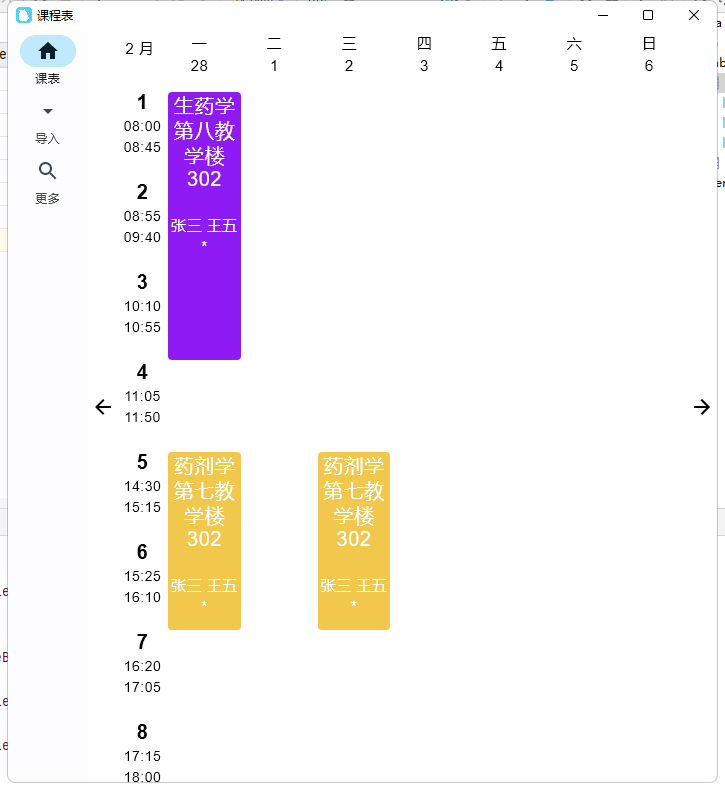

# 课程表(Desktop)(桌面版)

## 简介

针对河北大学的教务系统编写的课程，支持无校园网环境下一键导入个人课程。欢迎大佬PR

## 数据来源及其责任相关

数据来源：*河北大学本科生教务系统。*\
如有违规侵权行为，请邮件(1289142675@qq.com)联系本人，本人将第一时间停止违规侵权行为。

## 效果图



## 开发相关
- appData.db中有一部分初始数据
- 开源部分已经移除网络层
- UI：Compose For Desktop
- Data：Json Exposed
- Network：Ktor
- Navigation: Decompose 

## 集成开源及参考项目
- [Kotlin](https://github.com/JetBrains/kotlin)
- [Gson](https://github.com/google/gson)
- [Accompanist](https://github.com/google/accompanist)
- [Exposed](https://github.com/JetBrains/Exposed)
- [Compose For Desktop](https://www.jetbrains.com/lp/compose-desktop/)
- [Ktor](https://github.com/ktorio/ktor)
- [Decompose](https://github.com/arkivanov/Decompose)
- [moshi](https://github.com/square/moshi)
- [ksp](https://github.com/google/ksp)
- [kotlin-logging](https://github.com/MicroUtils/kotlin-logging)
- [slf4j](https://www.slf4j.org/)
- [sqlite-jdbc](https://github.com/xerial/sqlite-jdbc)

## 项目计划

- [x] 个人课表导入（统一认证、URP登陆均可）
- [ ] 成绩查询
- [ ] 成绩明细查询
- [ ] 手动增加、删除课程的基本课表管理功能
- [ ] 班级课表查询
- [ ] 班级课表导入
- [ ] 背景更换
- [ ] 课程格子渐变色和纯色切换
- [ ] 日视图小部件
- [ ] 周视图小部件
- [ ] 完整的课表管理功能
- [ ] 空教室查询
- [ ] 平时成绩查询
- [ ] 绩点、培养方案查询
- [ ] 作业本功能
- [ ] 工具箱功能-公告
- [ ] 工具箱功能-校历
- [ ] 工具箱功能-其他
- [ ] 课程格子自定义样式
- [ ] 一卡通流水查询~(由于一卡通管理处robot.txt显示禁止抓取，暂不实现该功能)~

## 关于我及更新相关

- 本科大三在读
- 药物制剂专业
- 药学里面会写代码的，写代码里面会搞药的。~~总之就是不务正业~~
- 课程较多更新随缘，药学生忙成🐶。

## 借鉴相关

可以借鉴，但希望在APP中注明。\
该APP的初始背景图片和LOGO禁止使用。\
~虽然不是非常好看，但是就是不能用┗|｀O′|┛~

## License

```License
Copyright 2021 sasaju https://github.com/sasaju/NormalSchedule

Licensed under the Apache License, Version 2.0 (the "License");
you may not use this file except in compliance with the License.
You may obtain a copy of the License at

    http://www.apache.org/licenses/LICENSE-2.0

Unless required by applicable law or agreed to in writing, software
distributed under the License is distributed on an "AS IS" BASIS,
WITHOUT WARRANTIES OR CONDITIONS OF ANY KIND, either express or implied.
See the License for the specific language governing permissions and
limitations under the License.
```
